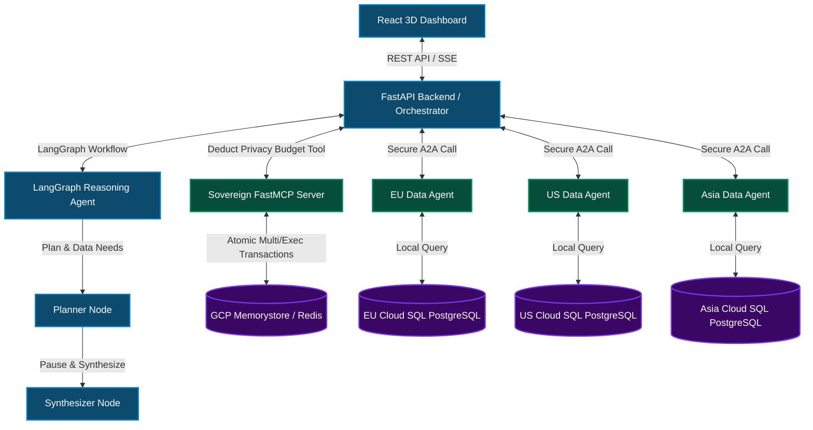

# Sovereign Mesh (Sovereign AI)

Sovereign Mesh is a decentralized, privacy-preserving multi-agent framework designed for secure cross-border collaborative analysis. It enables complex reasoning across regional databases (e.g., EU, US, Asia) without exposing raw PII (Personally Identifiable Information). By combining **LangGraph** agent orchestration, **OpenDP** differential privacy, **TenSEAL** homomorphic encryption, and the **Model Context Protocol (FastMCP)** compliance layer, Sovereign Mesh provides a mathematically secure, audited mechanism for federated analytics.

---

## 🌟 Key Features

*   **Federated Multi-Agent Orchestration**: Powered by **LangGraph** and **Gemini**, the mesh splits complex tasks into sequential, paused workflows that dynamically poll or callback regional databases.
*   **Differential Privacy (DP)**: Local agents apply mathematical noise via **OpenDP's** Laplace mechanism, protecting individual database records from membership inference attacks.
*   **Homomorphic Encryption (HE)**: Computes aggregations on encrypted tensors using the **TenSEAL** implementation of the CKKS scheme. Raw data is never decrypted outside the local node or a designated Secure Enclave.
*   **Model Context Protocol (MCP)**: A centralized, high-performance **FastMCP** server enforces a dynamic Privacy Budget ($\epsilon$) per region using atomic Redis transactions.
*   **Stunning 3D Mesh Visualizer**: An interactive dashboard built with React and **Globe.gl** that visualizes real-time query links, budget exhaustion, and live threat intelligence parsed from global APIs.
*   **Production Cloud Infrastructure**: Orchestrated deployment configurations for **Google Cloud SQL** (PostgreSQL), **Cloud Memorystore** (Redis), and **Cloud Run** containers.

---

## 🏗️ Architecture & Data Flow

Sovereign Mesh utilizes a decoupled Hub-and-Spoke topology where the **Orchestrator** coordinates tasks, the **Reasoning Agent** decides plans, the **MCP Server** guards limits, and **Regional Agents** serve data.

### System Topology



### Analytical Lifecycle

The diagram below details the sequence of a single cross-border tracking task:

```mermaid
sequenceDiagram
    autonumber
    actor User as User Dashboard
    participant Orch as ADK Orchestrator
    participant LangGraph as LangGraph Agent
    participant MCP as FastMCP Server
    participant Redis as Redis Budget Store
    participant RegionalAgent as Regional Data Agent
    participant PG as Regional SQL DB

    User->>Orch: Submit Task (e.g., "Analyze global disease vectors")
    Orch->>LangGraph: Forward Task to Planner Node
    Note over LangGraph: Planner decomposes query into<br/>regional needs (EU, US, Asia)
    LangGraph-->>Orch: Return Plan & Regional Data Queries
    
    rect rgb(15, 23, 42)
        Note over Orch, Redis: Phase: Compliance Check & Budget Reservation
        Orch->>MCP: Tool Call: deduct_privacy_budget(region, epsilon=1.0)
        MCP->>Redis: Watch budget key & read remaining budget
        alt Budget Available
            Redis-->>MCP: Approved (e.g., Budget: 10.0 -> 9.0)
            MCP-->>Orch: Budget Approved (Success)
        else Budget Exhausted
            Redis-->>MCP: Denied (e.g., Budget: 0.5 < 1.0)
            MCP-->>Orch: Budget Denied (Abort Execution)
        end
    end

    rect rgb(20, 8, 30)
        Note over Orch, PG: Phase: Local Anonymization & Encryption
        Orch->>RegionalAgent: Fetch Regional Payload (Query, approved epsilon)
        RegionalAgent->>PG: Run raw SQL database query
        PG-->>RegionalAgent: Return raw float metric (e.g., 150.0)
        Note over RegionalAgent: 1. Apply OpenDP Laplace mechanism<br/>2. Encrypt anonymized result with TenSEAL (CKKS)
        RegionalAgent-->>Orch: Return serialized homomorphically encrypted bytes
    end

    Orch->>LangGraph: Send aggregated encrypted tensors to Synthesizer
    Note over LangGraph: Perform secure multi-party aggregation<br/>inside Secure Enclave
    LangGraph-->>Orch: Decrypt aggregated insights (Outbreak Prob, Hotspots)
    Orch-->>User: Return Secure Aggregated Analytics Log & Results
```



---

## 📁 Repository Directory Structure

```text
Sovereign_Ai/
│
├── sovereign/                          # Core codebase
│   ├── backend/
│   │   ├── main.py                     # FastAPI web server and mock orchestrator REST API
│   │   └── requirements.txt            # Backend service package list
│   │
│   ├── dashboard/                      # Front-end system
│   │   ├── src/
│   │   │   ├── components/
│   │   │   │   ├── DataAgent.tsx       # Conversational AI interface for querying the mesh
│   │   │   │   ├── GlobalNodes.tsx     # 3D interactive Globe mesh visualizer
│   │   │   │   ├── MissionControl.tsx  # Federated analysis simulation & log terminal
│   │   │   │   ├── Settings.tsx        # System dashboard for DP and HE constraints
│   │   │   │   └── ThreatIntel.tsx     # Disease.sh API parser showing live threat data
│   │   │   ├── App.tsx                 # Base layout and sidebar router
│   │   │   └── index.css               # Modern CSS dark-mode design system stylesheet
│   │   ├── package.json                # Vite + React configurations
│   │   └── Dockerfile                  # Production container config for the dashboard
│   │
│   ├── mcp_server/                     # Production context for FastMCP deployment
│   │   ├── Dockerfile                  # Serverless container file
│   │   ├── deploy_cloud_run.ps1        # PowerShell deploy script targeting Google Cloud Run
│   │   └── requirements.txt            # Dedicated dependencies for MCP SSE transport
│   │
│   ├── orchestrator/
│   │   └── main.py                     # Mesh coordination and A2A routing mechanism
│   │
│   ├── reasoning_agents/
│   │   ├── agent.py                    # LangGraph configuration (Planner/Synthesizer nodes)
│   │   └── server.py                   # FastMCP Compliance Server implementation (Redis backed)
│   │
│   ├── regional_data_agents/
│   │   └── agent.py                    # OpenDP Laplace noise + TenSEAL CKKS encryption agent
│   │
│   ├── provision_gcp.ps1               # Infrastructure automation (SQL instances & Redis cache)
│   ├── requirements.txt                # Unified Python workspace dependencies
│   └── Dockerfile.backend              # Backend Docker setup
│
└── README.md                           # Project documentation (this file)
```

---

## 💻 Tech Stack & Subsystem Explanations

### 1. LangGraph Agent Orchestration (`sovereign/reasoning_agents/agent.py`)
Configures a deterministic workflow state machine:
*   **Planner Node**: Examines user requests and splits them into discrete database sub-queries directed at specific regional compliance zones.
*   **Synthesizer Node**: Aggregates processed outputs. It mock-decrypts final statistics on a Trusted Execution Enclave (TEE).
*   **State Control**: Operates conditional routing edges. In production setups, it invokes `pause` states while waiting for asynchronous A2A network payloads.

### 2. FastMCP Compliance Server (`sovereign/reasoning_agents/server.py`)
Acts as a Model Context Protocol tool provider:
*   **Dynamic Privacy Budget**: Tracks regional budgets ($\epsilon$) in Redis.
*   **Concurrency Safe**: Utilizes Redis `WATCH` pipelines to guarantee atomic multi-client budget subtraction, avoiding double-spending of the privacy budget.
*   **Compliance Logger**: Emits persistent audit records for GDPR/HIPAA verification.

### 3. Privacy-Preserving Agent (`sovereign/regional_data_agents/agent.py`)
Secures local data stores at rest and in transit:
*   **OpenDP**: Applies Laplace noise inversely proportional to the user-supplied privacy budget:
    $$\text{Scale} = \frac{1}{\epsilon}$$
*   **TenSEAL (HE)**: Initializes a CKKS scheme context with parameters (`poly_modulus_degree=8192` and bit sizes `[60, 40, 40, 60]`). It homomorphically encrypts the perturbed value into a secure floating-point vector, ensuring mathematical operations can occur in transit without exposure.

### 4. Interactive 3D Frontend (`sovereign/dashboard`)
*   Uses a tailored dark-theme CSS design system with subtle glow indicators and border-radii cards.
*   Employs `react-globe.gl` and `three.js` to construct a real-time data-flow globe showing visual node-to-node links.

---

## 🚀 Getting Started

### 📋 Prerequisites

*   Python 3.10 or 3.11 installed.
*   Node.js (version 18+ recommended) and `npm`.
*   A running Redis instance (either local or Cloud Memorystore).
*   Google Cloud SDK installed (if provisioning cloud assets).

### 🛠️ Local Setup

1.  **Clone the Repository**:
    ```bash
    git clone https://github.com/codenerd2500/Sovereign_Ai.git
    cd Sovereign_Ai
    ```

2.  **Configure Python Workspace**:
    Create a virtual environment and install the required dependencies:
    ```bash
    python -m venv .venv
    # On Windows:
    .venv\Scripts\activate
    # On Linux/macOS:
    source .venv/bin/activate

    pip install -r sovereign/requirements.txt
    ```

3.  **Ensure Redis is running**:
    Start Redis locally on the default port `6379`.
    ```bash
    # e.g., using Docker
    docker run -d --name local-redis -p 6379:6379 redis:alpine
    ```

4.  **Start the MCP Server**:
    Set the environment variables and run the compliance server:
    ```bash
    # On Windows PowerShell:
    $env:REDIS_HOST="localhost"
    $env:REDIS_PORT="6379"
    $env:PORT="8080"
    python sovereign/reasoning_agents/server.py

    # On Unix:
    REDIS_HOST=localhost REDIS_PORT=6379 PORT=8080 python sovereign/reasoning_agents/server.py
    ```

5.  **Start the FastAPI Backend**:
    From the root directory, run the backend FastAPI API:
    ```bash
    # Ensure virtual env is active
    uvicorn sovereign.backend.main:app --host 0.0.0.0 --port 8000 --reload
    ```

6.  **Run the React Dashboard**:
    Navigate to the dashboard directory, install packages, and launch Vite:
    ```bash
    cd sovereign/dashboard
    npm install
    npm run dev
    ```
    Open `http://localhost:5173` in your browser.

---

## ☁️ Google Cloud Platform Deployment

Sovereign Mesh includes pre-packaged configuration scripts for automated GCP provisioning.

### 1. Provision Infrastructure (`provision_gcp.ps1`)
This script activates Google Cloud APIs and creates Cloud SQL instances alongside Cloud Memorystore Redis instances inside your VPC:
```powershell
# Authenticate with gcloud CLI
gcloud auth login

# Run provisioning script with your Project ID
.\sovereign\provision_gcp.ps1 -ProjectId "your-gcp-project-id"
```
The script provisions:
*   `sovereign-redis` (Memorystore basic tier instance) in `us-central1`.
*   Three micro PostgreSQL instances (`sovereign-pg-us`, `sovereign-pg-eu`, `sovereign-pg-asia`).

### 2. Deploy FastMCP Server (`deploy_cloud_run.ps1`)
Navigate to the `mcp_server` directory and launch the Cloud Run deployment script:
```powershell
cd sovereign/mcp_server

# Build and deploy the Docker image using Cloud Build
.\deploy_cloud_run.ps1 -ProjectId "your-gcp-project-id" -RedisHost "your-redis-private-ip" -RedisPort "6379"
```
This packages `server.py` and registers the endpoints with an HTTP SSE (Server-Sent Events) container registry configuration.

### 3. Deploy Backend API
Build and deploy the backend directory using the provided `Dockerfile.backend`:
```bash
gcloud run deploy sovereign-backend `
    --source . `
    --file sovereign/Dockerfile.backend `
    --region us-central1 `
    --allow-unauthenticated
```

---

## 🛡️ License

This project is licensed under the Apache License 2.0. See the LICENSE file for details.
